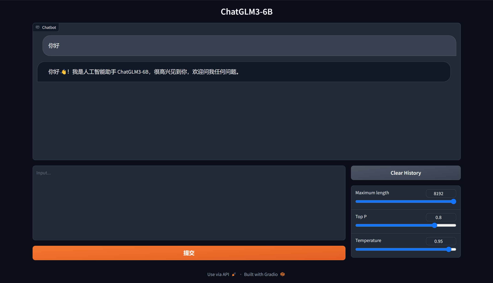
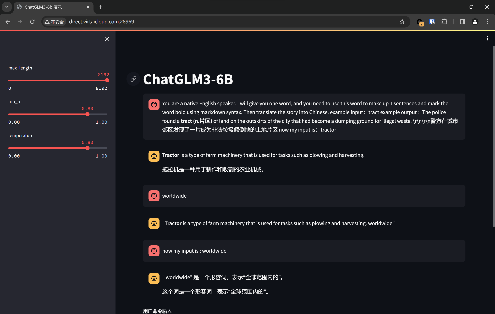

# 任务一：部署 ChatGLM3-6B

教程地址：[‍⁢⁣⁤⁣⁤‍‬‍⁣‌⁤⁡‌‌⁤⁣‬⁡⁡‍⁡‍⁢‌‌‌‬⁣⁡‌‬‌⁡⁤⁣如何用免费GPU线上跑AI项目实践 - 飞书云文档 (feishu.cn)](https://nuly9zxzf1.feishu.cn/docx/HOmzdmST9oc43gxjTF0c7PAAnnb)

## 项目创建

- 镜像选择 PyTorch 2.0.1 + Conda 3.9

- 预训练模型选择 ChatGLM3-6B (也可以自己上传)
- 创建项目时，不上传代码，后续手动通过 `git clone` 拉取
- 资源配置选择 B1.Large  24G 显存即可

## 环境配置

- 进入 JupyterLab
- 打开终端，修改 `pip` 源为清华源
- 克隆项目：`git clone https://github.com/THUDM/ChatGLM3.git`
- 镜像已经配置了 PyTorch，因此可以在 `requirements.txt` 中删去 `torch>=2.0` 的要求
- 使用 `pip install -r requirements.txt` 安装依赖
- 修改 `web_demo2.py` 和 `web_demo.py` 的模型加载路径为 `../../pretrain`
- 为使用端口转发服务，将 `web_demo.py` 的启动方式改为

```python
demo.queue().launch(share=False, server_name="0.0.0.0", server_port=7000)
```

- 在平台右侧添加端口映射，放行端口 `7000` 

## 运行

### Gradio

`web_demo.py` 使用 `gradio` 作为 UI 服务，使用下面的代码即可运行：

```bash
python web_demo.py
```



### Streamlit

`web_demo2.py` 使用 `gradio` 作为 UI 服务，使用下面的代码即可运行：

```bash
streamlit run web_demo2.py
```

随后终端中会打印服务地址，将对应的端口放行即可。



## 结束

结束时记得释放资源，以免过度扣费。